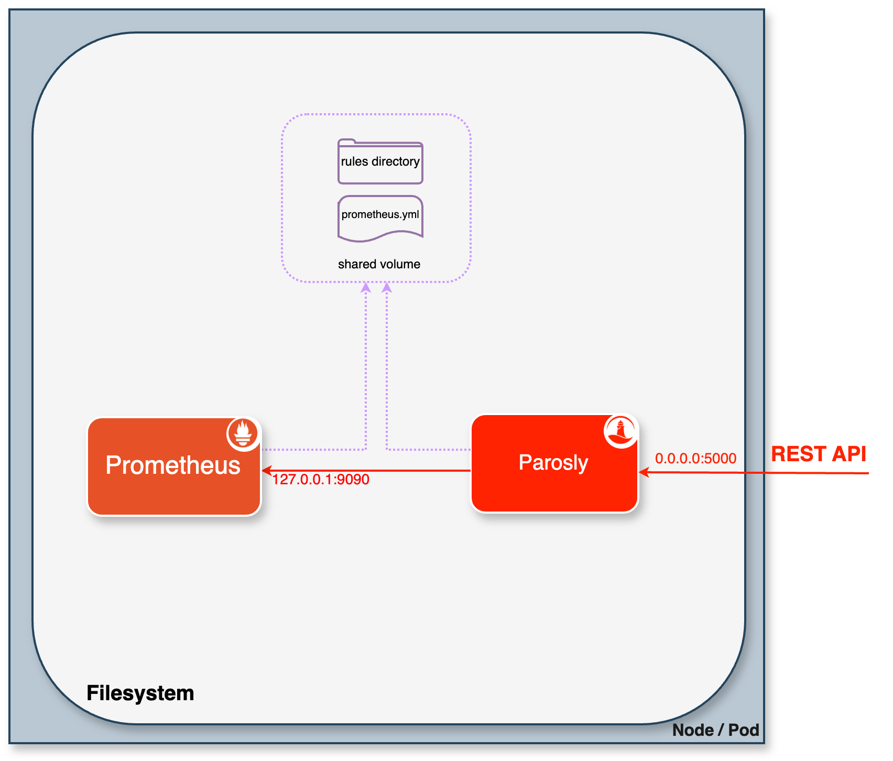
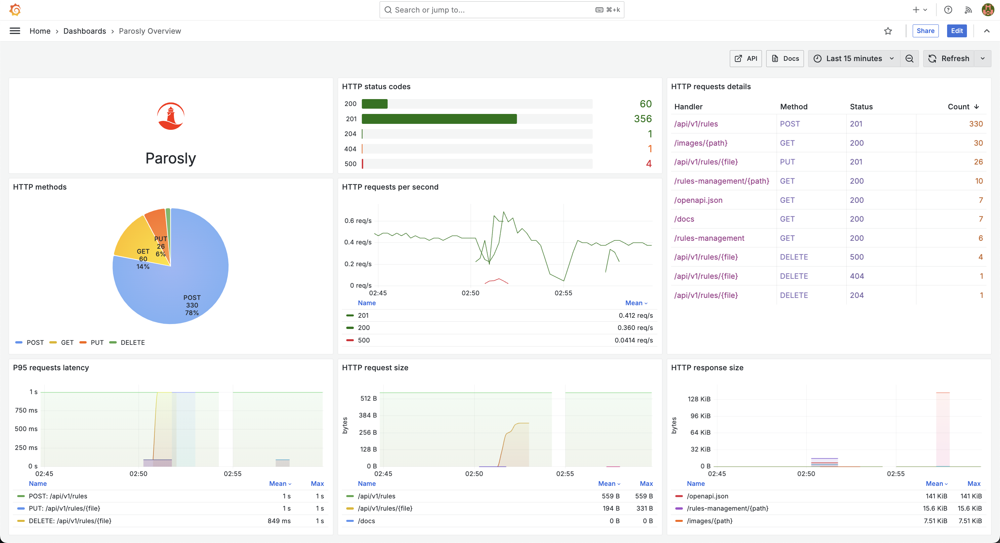
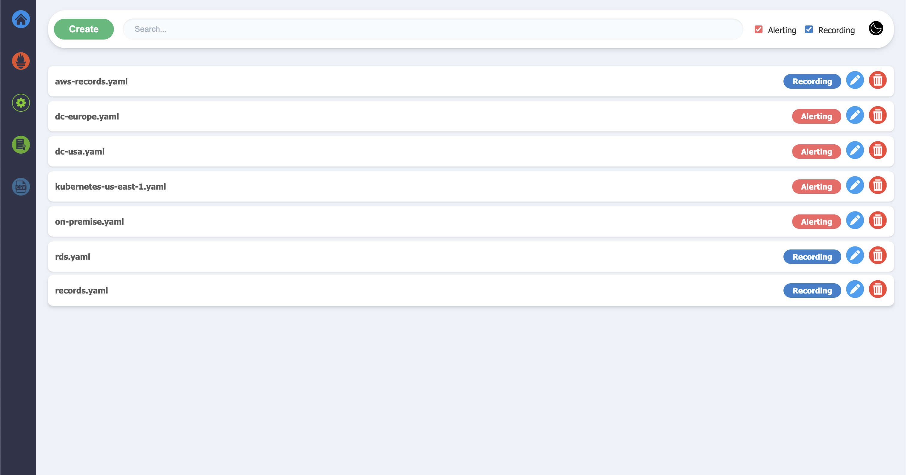

<h1 align="center" style="border-bottom: none">
    <a href="https://docs.parosly.io" target="_blank"></a><br>Parosly
</h1>

<p align="center">Visit <a href="https://docs.parosly.io" target="_blank">docs.parosly.io</a> for the full documentation,
examples and guides.</p>

<div align="center">


[](https://github.com/parosly/parosly/releases)


[](https://hub.docker.com/r/parosly/parosly/)
[](https://hub.docker.com/r/parosly/parosly/)
[](https://hub.docker.com/r/parosly/parosly/)

</div>

<!-- TABLE OF CONTENTS -->
<details open="open">
  <summary>Table of Contents</summary>
  <ol>
    <li>
      <a href="#about-the-project">About The Project</a>
    </li>
    <li>
      <a href="#architecture-overview">Architecture Overview</a>
    </li>
    <li>
      <a href="#getting-started">Getting Started</a>
      <ul>
        <li><a href="#prerequisites">Prerequisites</a></li>
        <li><a href="#quick-start">Quick Start</a></li>
      </ul>
    </li>
    <li><a href="#examples">Examples</a></li>
    <li><a href="#api-model">API model</a></li>
    <li><a href="#configuration">Configuration</a></li>
    <li><a href="#grafana-dashboard">Grafana dashboard</a></li>
    <li><a href="#web-ui">Web UI</a></li>
    <li><a href="#author-and-maintainer">Author and Maintainer</a></li>
    <li><a href="#license">License</a></li>
  </ol>
</details>

<!-- ABOUT THE PROJECT -->
## About The Project

This project enhances the native [Prometheus HTTP API](https://prometheus.io/docs/prometheus/latest/querying/api/) by 
providing additional features and addressing its limitations. Running as a sidecar alongside the Prometheus server 
enables users to extend the capabilities of the API.

One notable limitation of the native Prometheus HTTP API is the inability to programmatically create/delete rules. This 
project addresses this limitation by offering a solution for rule creation/deletion via the API. By leveraging 
Parosly, users can overcome the native constraints, gaining the ability to create rules programmatically. This 
enhances flexibility and automation in monitoring and alerting workflows.

> ⓘ The decision to exclude a rule creation feature in the Prometheus API, as discussed in 
> [this GitHub issue](https://github.com/prometheus/alertmanager/issues/552), prioritizes stability and integrity within
> the Prometheus ecosystem. Parosly serves as an external solution, seamlessly integrating with existing 
> Prometheus deployments while providing the sought-after rule-creation capability.

<!-- ARCHITECTURE OVERVIEW -->
## Architecture Overview


<!-- GETTING STARTED -->
## Getting Started

### Prerequisites

The following prerequisites are required to get up and running with this tool:
- Prometheus server's rules directory and configuration file (prometheus.yml) must be shared and accessible
- Prometheus lifecycle API must be enabled to allow requesting the /reload API

### Quick Start

Get Parosly up and running in minutes.    
In this quick-start guide, you will run Prometheus and Parosly services using Docker Compose and send requests to
the API service. Please refer to [this example](https://github.com/parosly/parosly/tree/main/docs/examples/docker#getting-started-with-docker-compose) 
guide to get started.

<!-- ARCHITECTURE OVERVIEW -->
## Examples
A simple example of recording rules created using an API would be:

### Request

```shell
curl -i -XPUT 'http://localhost:5000/api/v1/rules/example-record.yml' \
--header 'Content-Type: application/json' \
--data '{
  "data": {
    "groups": [
      {
        "name": "ExampleRecordingRule",
        "rules": [
          {
            "record": "code:prometheus_http_requests_total:sum",
            "expr": "sum by (code) (prometheus_http_requests_total)"
          }
        ]
      }
    ]
  }
}'
```

### Response

```
HTTP/1.1 201 Created
content-length: 66
content-type: application/json

{"status":"success","message":"The rule was created successfully"}
```

<!-- ARCHITECTURE OVERVIEW -->
## API Model

The Parosly, built upon REST API design principles, provides a seamless and efficient way to interact with 
native Prometheus HTTP API. If you would like to explore its capabilities and learn more about its endpoints, request 
formats, and response structures, please refer to the comprehensive documentation available [here](https://docs.parosly.io).

<!-- CONFIGURATION -->
## Configuration

### Flags

```text
usage: python3 main.py [option]

Extended HTTP API service for Prometheus

optional arguments:
  -h, --help            show this help message and exit
  --web.listen-address WEB.LISTEN_ADDRESS
                        address to listen on for API
  --file.prefix FILE.PREFIX
                        a prefix of filenames generated by the server
  --file.extension FILE.EXTENSION
                        rule files will be created with this suffix
  --log.level {debug,info,warning,error}
                        only log messages with the given severity or above. One of: [debug, info, warning, error]
  --web.enable-ui {true,false}
                        enable web management UI

required parameters:
  --rule.path RULE.PATH
                        Prometheus rules directory path
  --config.file CONFIG.FILE
                        Prometheus configuration file path                        
  --prom.addr PROM.ADDR
                        URL of Prometheus server, e.g. http://localhost:9090
```

<!-- GRAFANA DASHBOARD -->
## Grafana dashboard

Grafana dashboard JSON model is available [here](https://github.com/parosly/parosly/tree/main/grafana/dashboard.json).


<!--Web UI -->
## Web UI
The web user interface is enabled by default but can be disabled using `--web.enable-ui=false`. It provides a convenient 
and flexible way to manage Prometheus configurations, rules, and more.



<!-- CONTACT -->
## Author and Maintainer

Hayk Davtyan:
- Email - hayk@parosly.io
- GitHub - [hayk96](https://github.com/hayk96)

## License

MIT License, see [LICENSE](https://github.com/parosly/parosly/blob/main/LICENSE).
